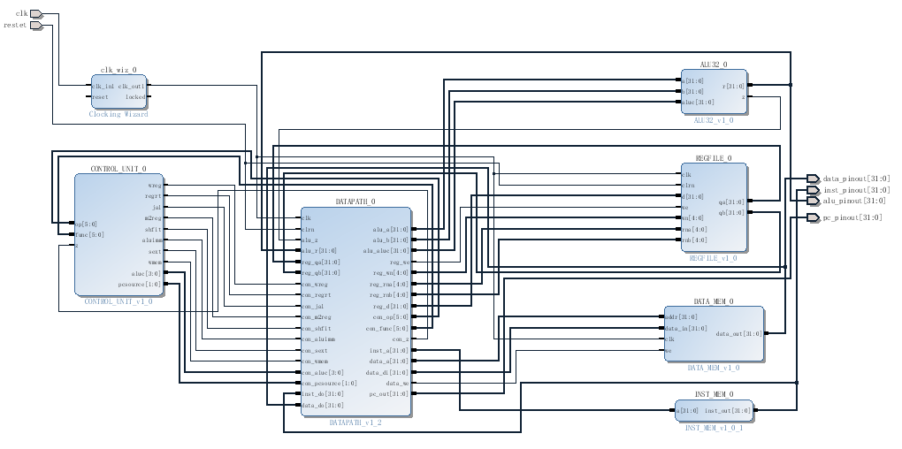
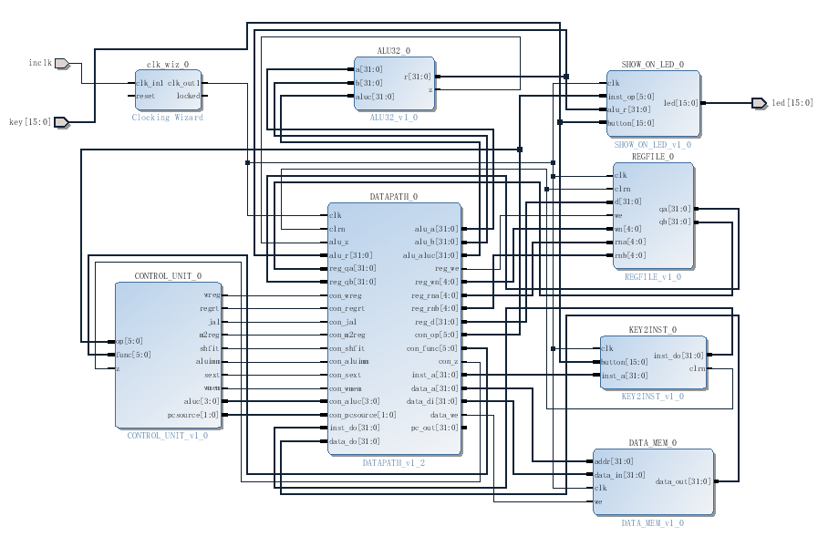
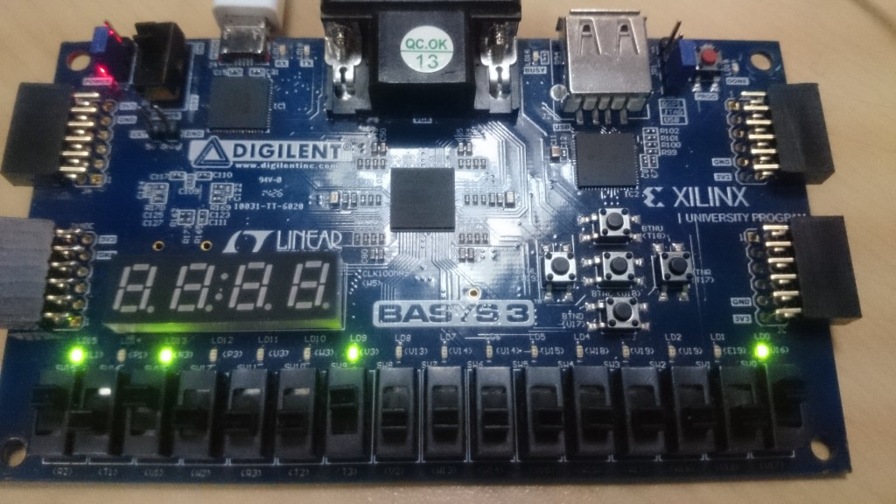

# SIMPLE_MIPS_CPU  
<h3>A simple MIPS CPU, 32bits, designed with verilogHDL, bulit on xilinx vivado.</h3>
<h4>Design for Southeast University : Subject "Computer Organization and Design".</h4>  

***  

**CPU for simulation----100%.**   
**CPU on board----100%.**  
**ProjectTcl.----100%.**

**ALU----100%.**  
**REGFILE----100%.**  
**CONTROL_UNIT----100%.**  
**DATAPATH----100%.**

Files and Descriptions:  
=====

Sub modules(SUB_MODULE):
-----------
**ALU（ALU\ALU.srcs）:**  
1. ALU.v: ALU  
2. LOGIC.v: AND/OR/XOR/LUI    
3. MATH.v: ADD/SUB  
4. SHIFT.v: SLL,SRL,SRA  
5. ALU_TB.sv: TestBench for ALU.  

**REGFILE（REGFILE\REGFILE.srcs）:**  
1. REGFILE.v: REGFILE  
2. REGFILE_TB.sv: TestBench for REGFILE.

**CONTROL_UNIT（CONTROL_UNIT\CONTROL_UNIT.srcs）:**  
1. CONTROL_UNIT.v: CONTROL_UNIT  
2. CONTROL_UNIT_TB.sv: TestBench for CONTROL_UNIT.

**DATAPATH（DATAPATH\DATAPATH.srcs）:**  
1. DATAPATH.v: DATAPATH  
2. ADDSUB32.v: For processing next pc address when jump.  

**INST_MEM（INST_MEM\INST_MEM.srcs）:**  
1. INST_MEM.v: A list which has some inst, for test.    

**DATA_MEM（DATA_MEM\DATA_MEM.srcs）:**  
1. DATA_MEM.v: A ram, for test.   

**KEY2INST（KEY2INST\KEY2INST.srcs）:**  
1. KEY2INST.v: Convert keys' states to CPU instruction.     
2. KEY2INST_TB.sv: TestBench for KEY2INST.  

**SHOW_ON_LED（SHOW_ON_LED\SHOW_ON_LED.srcs）:**  
1. SHOW_ON_LED.v: Show result or keys' state on leds.   

ProjectTcl(ProjectTcl):
-----------
**Tcl projects, you can source run_on_board.tcl or simulation.tcl in "ProjectTcl/Tcl" to build a new project, then all will be done.** 

CPU for simulation(CPU_FOR_SIM):
-----------
**A project for function sim, use some instructs and data which are predefined.**  
**IPCORE(IPCORE\\):**  
Sub modules are here.  

**CPU_FOR_SIM.srcs:**  
1. MIPS_CPU_TB.sv: TestBench for function simulation.  
2. MIPS_CPU.bd: CPU board.

  
  

CPU on board.(CPU_ON_BOARD):
-----------
**A project for testing on board, you can input cmd by keys, then leds willshow the result.**  
**The function of buttons and leds are here:**  

**IPCORE(IPCORE\\):**  
Sub modules are here. 

**CPU_ON_BOARD.srcs:**  
1. MIPS_CPU.xdc: Constraints file for Basys3 board.  
2. MIPS_CPU.bd: CPU board.  

  

An exmple:  
 
1. Reset:  
 

2. Set data_b high 8bits to "00000001":  
 

3. Run, get result = "0000000100000000" + "0000000000000000"= "0000000100000000":
 

AUTHOR
---
**Dai Tianyu(dtysky)**   
[http://dtysky.github.io](http://dtysky.github.io)  
[dtysky@outlook.com](dtysky@outlook.com)  
[http://github.com/dtysky](http://github.com/dtysky)

Copyright
---
Copyright © 2014, Dai Tianyu(dtysky). All Rights Reserved.  
This project is free software and released under the [MIT License (MIT)](http://mit-license.org/).