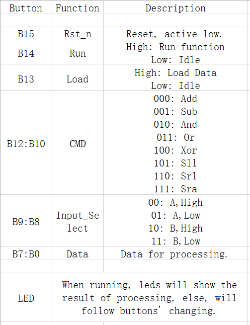
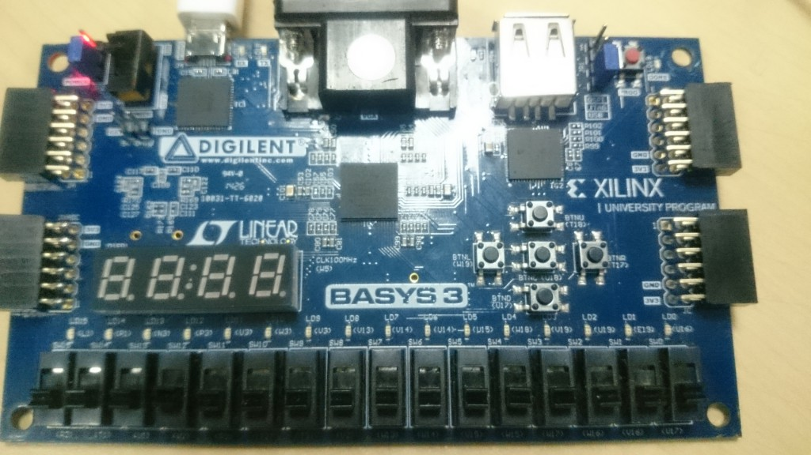
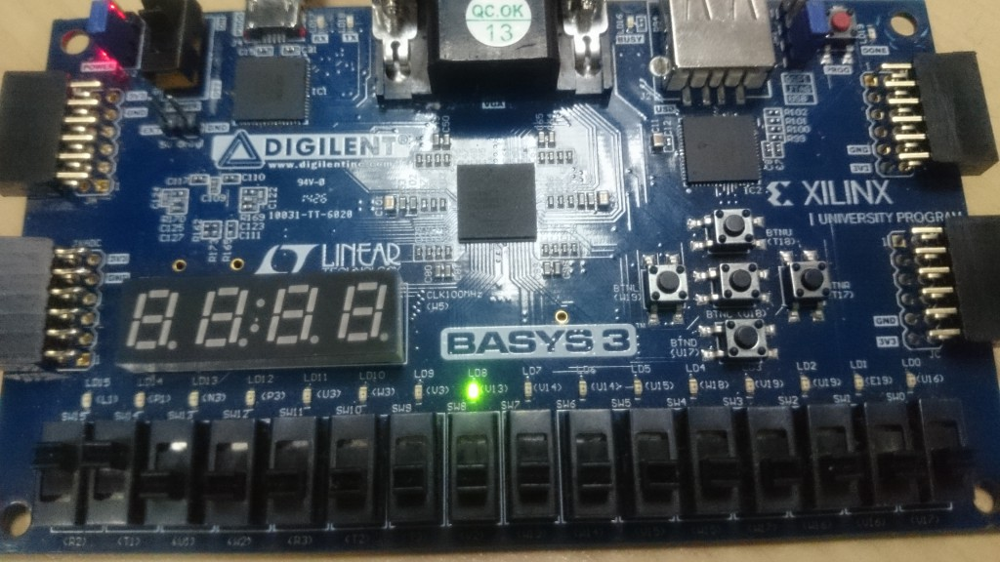

# SIMPLE_MIPS_CPU  
<h3>A simple MIPS CPU, 32bits, designed with verilogHDL, bulit on xilinx vivado.</h3>

***  

Files and Descriptions:  
=====

Discription:
------
**This CPU is a simple-32bits CPU, it allowed to run one instruction every cycle.  
Some sub modules are used to this CPU as follows:**  

Sub modules(SUB_MODULE):
-----------
**ALU:**  
Function:  
Arithmetic Logic Unit, all arithmetic will be process here, like add,sub,shift and so on...  
Sources:  
1. ALU.v: ALU top module.  
2. LOGIC.v: AND/OR/XOR/LUI.    
3. MATH.v: ADD/SUB.  
4. SHIFT.v: SLL,SRL,SRA.  
5. ALU_TB.sv: TestBench for ALU.  

**REGFILE:**  
Function:  
A 32 deeps register file，for caching this data from memory or alu's result...  
Sources:  
1. REGFILE.v: REGFILE top module.  
2. REGFILE_TB.sv: TestBench for REGFILE.

**CONTROL_UNIT:**  
Function:  
Convert the control instruction to control signals.    
Sources:   
1. CONTROL_UNIT.v: CONTROL_UNIT top module.  
2. CONTROL_UNIT_TB.sv: TestBench for CONTROL_UNIT.

**DATAPATH:**  
Function:  
Connect all sub modules, the instruction counter also located here.    
Sources:  
1. DATAPATH.v: DATAPATH top module.   
2. ADDSUB32.v: For processing next pc address when jump.  

**INST_MEM:**  
Function:  
An instruction memory, storing test instructions in this priject.    
Sources:  
1. INST_MEM.v: A list which has some inst, for test.    

**DATA_MEM:**  
Function:  
An data memory, storing test data in this priject. 
Sources:  
1. DATA_MEM.v: A ram, for test.   

**KEY2INST:**  
Function:  
Convert the switchs' states to CPU's instructions, for testing this CPU on board.  
Sources: 
1. KEY2INST.v: Convert switchs' states to CPU instruction.     
2. KEY2INST_TB.sv: TestBench for KEY2INST.  

**SHOW_ON_LED:**  
Function:  
Show result or keys' state on leds.   
Sources: 
1. SHOW_ON_LED.v: Show result or keys' state on leds.   

Tcl:
-----------
**Two tcl files are here, they will build two different projects.  
If you source the "simulation.tcl", project "CPU for simulation" will be built, and then the simulation will be done automatically.  
If soure the "run_on_board.tcl", project "CPU on board" will be built, then synthesis and implementation will be done.** 

CPU for simulation(CPU_FOR_SIM):
-----------
**A project for function sim, use some instructs and data which are predefined.**  

**Sources:**  
1. MIPS_CPU_TB.sv: TestBench for function simulation.  
2. MIPS_CPU.bd: CPU board.

  

CPU on board.(CPU_ON_BOARD):
-----------
**A project for testing on board, you can input cmd by keys, then leds willshow the result.**  
**The function of switchs and leds are here:**  
  

**Sources:**  
1. MIPS_CPU.xdc: Constraints file for Basys3 board.  
2. MIPS_CPU.bd: CPU board.  

**An exmple:**  
 
1. Set B15 to '0', do Reset:  
 

2. Set B9:B8 to "10", B7:B0 to "00000001", the set B13 to '1', do Load "data\_bh", so data\_bl will be changed to "00000001", repeat the steps to load data\_ah, data_al, and data\_bl:  
 

3. Set B14 to '1' and B12:B10 TO "000", do Run "Add", the result = "0000000100000000" + "0000000000000000"= "0000000100000000" will be displaied on leds:
 

AUTHOR
---
XUP(Xlinx University Program).